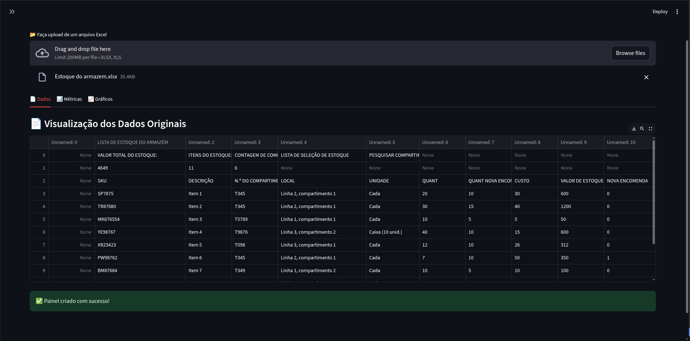
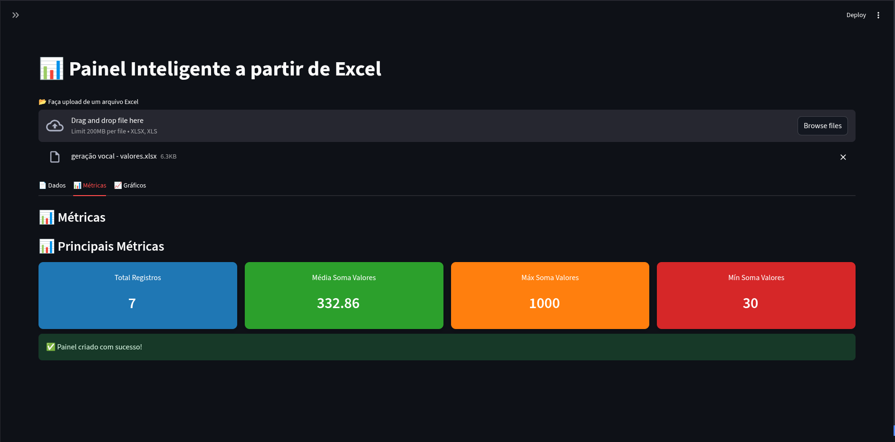

# 📊 Painel Inteligente Excel - Streamlit

  

---

## 🔥 Sobre o Projeto

O **Painel Inteligente Excel** é uma aplicação web construída em **Streamlit** que transforma arquivos Excel em dashboards interativos e visualmente atraentes, inspirados no estilo do **Power BI**.  

Ele permite:

✨ **Funcionalidades principais:**
- 📂 Upload de arquivos Excel (.xlsx / .xls).  
- 🔎 Filtros interativos para colunas numéricas, categóricas e datas.  
- 📄 Visualização dos dados originais.  
- 📊 Cards modernos com métricas principais (total, média, mínimo, máximo).  
- 📈 Gráficos interativos usando **Plotly** (histogramas, barras, séries temporais).  
- 🎨 Layout moderno, responsivo e personalizável via CSS.  

O objetivo é oferecer uma **experiência intuitiva e próxima do Power BI**, diretamente no navegador, sem necessidade de software adicional.

---

## 🖼️ Imagens do Projeto

<div style="display: flex; gap: 20px; margin-bottom: 10px;">
  
  
</div>

<div style="margin-top: 10px;">
  
</div>

---

## 🎨 Funcionalidades Principais

### 1️⃣ Upload de Arquivos
- 📂 Aceita arquivos Excel (.xlsx / .xls).  
- 👀 Suporta pré-visualização dos dados.  
- 📝 Exibe nome e tamanho do arquivo carregado.

### 2️⃣ Filtros Interativos
- ⚙️ Filtros na sidebar para **colunas numéricas, categóricas e datas**.  
- 🔄 Combinação de múltiplos filtros.  
- 🧹 Filtros resetáveis.

### 3️⃣ Métricas Estilo Power BI
- 📊 Cards modernos para cada métrica.  
- 📈 Exibe **total de registros**, **média**, **mínimo** e **máximo**.  
- 🎨 Personalizável com cores e ícones.

### 4️⃣ Gráficos Interativos
- 📊 Gráficos Plotly Express responsivos.  
- 📉 Histogramas para dados numéricos.  
- 📊 Barras para dados categóricos.  
- ⏱️ Séries temporais para colunas de data.  
- 🖱️ Hover info e legendas detalhadas.

### 5️⃣ Extras
- 💾 Exportação de dados filtrados para Excel/CSV.  
- 🔍 Busca global nos dados.  
- 🌗 Tema escuro/claro (via CSS).  
- 🖥️ Layout moderno e responsivo.

---

## 💻 Tecnologias Utilizadas
- 🐍 [Python 3.10+](https://www.python.org/)  
- 🌊 [Streamlit](https://streamlit.io/)  
- 🐼 [Pandas](https://pandas.pydata.org/)  
- 📊 [Plotly Express](https://plotly.com/python/plotly-express/)  
- ⚡ [Streamlit Extras](https://github.com/MarcSkovMadsen/streamlit-extras)  

---

## 🚀 Instalação

1️⃣ Clone o repositório:

```bash
git clone https://github.com/AndersonLima12/excel-python
cd excel-python
